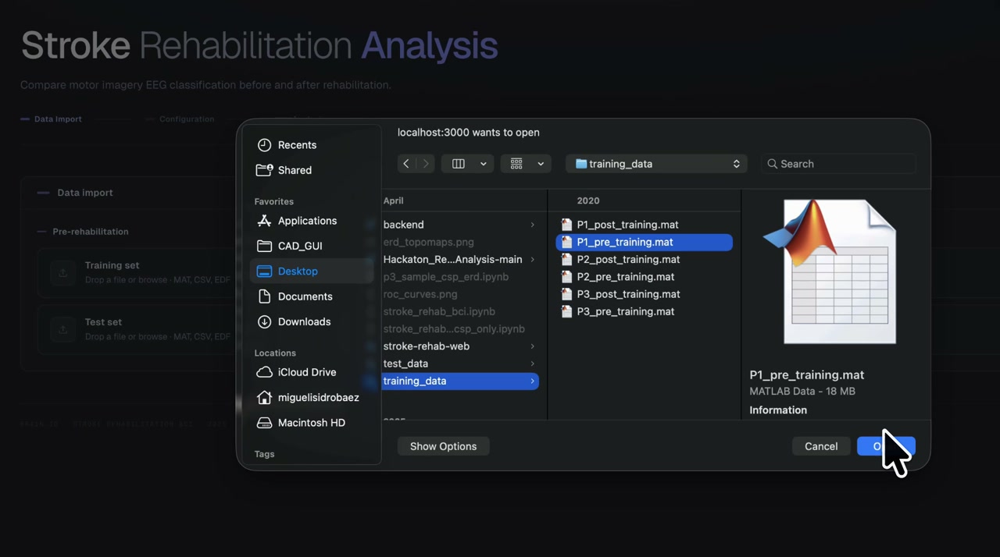

# Stroke Rehab EEG Platform

<div align="center">
  <a href="./public/recording.mp4">
    
  </a>
  <br />
  <a href="./public/recording.mp4"><strong>Watch the 44-second demo</strong></a>
</div>

## Goal

> Develop a reproducible EEG analysis pipeline that quantifies changes in motor-imagery decoding performance before and after stroke rehabilitation.

This research MVP compares EEG recordings collected before and after rehabilitation. It measures changes in signal decodability and classification performance. It does not diagnose patients or claim to prove clinical recovery.

## How it works

1. Upload PRE and POST rehabilitation training and test recordings.
2. Configure the EEG frequency range, notch filter, epoch window, CSP components, and FBCSP feature count.
3. Run the same preprocessing and evaluation pipeline for both sessions.
4. Compare CSP-LDA and FBCSP-LDA results through metrics and visualizations.

The default band-pass range is 4 to 40 Hz. The current loader supports the BR41N.IO MAT structure and the legacy nested MAT structure.

## What the platform provides

- A guided four-file upload flow for PRE training, PRE test, POST training, and POST test data.
- A fixed 16-channel motor-imagery montage with an electrode training view.
- FIR notch and band-pass filtering, epoch cropping, training-based normalization, and optional AutoReject integration.
- CSP and Filter Bank CSP feature extraction with shrinkage LDA classification.
- Holdout evaluation and five-fold stratified cross-validation.
- Accuracy, Cohen's kappa, macro F1, precision, recall, ROC-AUC, confusion matrices, ROC curves, and PSD plots.
- A responsive Next.js interface backed by an independent FastAPI processing service.

## Analysis flow

```text
Four EEG recordings
  -> channel selection
  -> filtering and epoch preparation
  -> CSP and FBCSP feature extraction
  -> shrinkage LDA classification
  -> holdout and cross-validation metrics
  -> PRE versus POST comparison
```

## Technology

| Layer | Tools |
| --- | --- |
| Web interface | Next.js 16, React 19, TypeScript, Tailwind CSS |
| API | FastAPI and Pydantic |
| EEG processing | NumPy, SciPy, MNE, optional AutoReject |
| Machine learning | scikit-learn, CSP, FBCSP, shrinkage LDA |
| Testing | Pytest, FastAPI TestClient, ESLint, TypeScript |

## Run locally

### Requirements

- Node.js 20 or newer
- npm
- Python 3.10 or newer
- pip or a compatible Python environment manager

### Install

```bash
npm install
python -m pip install -r backend/requirements-dev.txt
cp .env.example .env.local
```

### Start the API

```bash
python -m uvicorn backend.app.main:app --reload --host 0.0.0.0 --port 8000
```

### Start the web application

Open a second terminal and run:

```bash
npm run dev
```

Open [http://localhost:3000](http://localhost:3000). The API health endpoint is available at [http://localhost:8000/health](http://localhost:8000/health).

## Environment configuration

```dotenv
NEXT_PUBLIC_API_BASE_URL=http://localhost:8000
CORS_ORIGINS=http://localhost:3000,http://127.0.0.1:3000
```

`NEXT_PUBLIC_API_BASE_URL` is exposed to the browser. Do not store secrets in variables that use the `NEXT_PUBLIC_` prefix.

## Repository structure

```text
backend/
├── app/
│   ├── api/             HTTP routes and request parsing
│   ├── domain/          Shared types, constants, and errors
│   ├── processing/      Loading, channels, filters, and artifact handling
│   ├── models/          CSP and FBCSP feature pipelines
│   ├── evaluation/      Metrics and cross-validation
│   ├── services/        Complete analysis orchestration
│   └── presentation/    Stable JSON response construction
└── tests/               Unit and API integration tests

src/
├── app/                 Next.js application shell and global styles
├── features/analysis/   Analysis UI, state, API client, types, and montage
├── components/ui/       Reusable interface components
└── lib/                 Shared frontend utilities

docs/                    Architecture and contributor documentation
public/                  Demo video and visual assets
```

## API

| Method | Endpoint | Purpose |
| --- | --- | --- |
| `GET` | `/health` | Check whether the API is running. |
| `POST` | `/process` | Process one training and test dataset pair. |
| `POST` | `/api/preprocess` | Compatibility alias for `/process`. |

## Verification

Run these checks before submitting changes:

```bash
npm run lint
npm run build
python -m pytest backend/tests -q
```

Complete one analysis with all four EEG recordings after changing processing, model, or API behavior.

## Contributor guide

Read the following documents before extending the platform:

- [Team handoff](docs/TEAM_HANDOFF.md) describes the implemented work and current limitations.
- [Architecture](docs/ARCHITECTURE.md) explains runtime boundaries and data flow.
- [Adding features](docs/ADDING_FEATURES.md) identifies the correct extension points for models, processing, API fields, and interface panels.

Keep numerical processing independent from FastAPI, keep network requests outside React components, and update tests whenever behavior changes.
